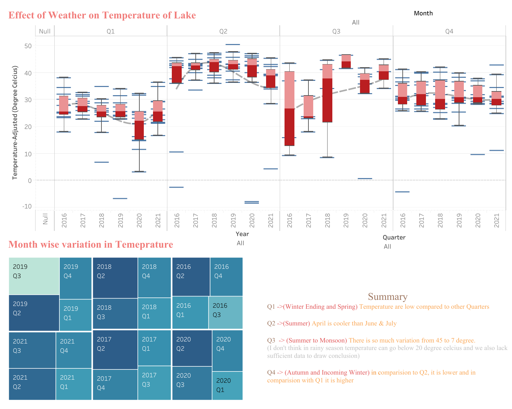

# **FINAL REPORT:** 
# Monitoring the Water Quality in Bhopal Region using Satellite Imagery and GIS Techniques

## A project by Omdena VIT Bhopal University Local Chapter


<p align="center">
  
</p>

# Executive Summary
'Monitoring the Water Quality in Bhopal Region using Satellite Imagery and GIS Techniques', a project by the Omdena VIT BHopal University Local Chapter led by chapter leads Vaasu Bisht and Eeman Majumder, lasted over 5 weeks and saw the cooperation of an international team of AI engineers. These cooperated steadily to define and to develop a comprehensive solution to the challenge of monitoring water quality in the Bhopal region. The team utilized cutting-edge GIS techniques and machine learning algorithms to analyze satellite imagery data and extract relevant parameters for water quality monitoring.The project's success can be attributed to the team's effective communication, careful planning, and dedication to achieving the project's objectives. By leveraging the power of data science and international collaboration, the team was able to provide a cost-effective and efficient solution to monitor water quality in the Bhopal region, which will contribute to ensuring sustainable development and protecting the environment.

# Introduction
The primary objective of this challenge is to find effective ways to monitor water quality in the Bhopal region using satellite imagery. The purpose of this project is to reduce the cost of the monitoring process, as the current method utilizing IoT sensors requires a significant amount of maintenance, making it an expensive process. The main goal of the project is to identify parameters that can be used to monitor water quality, establish a standardized way of collecting real-time data, identify any discrepancies in the current monitoring process, and improve them as much as possible. To achieve these objectives, a detailed data analysis will be conducted. We will examine a range of satellite imagery data and extract the relevant parameters that can be used to monitor water quality. By analyzing this data, we will be able to identify patterns and trends that can be used to improve the monitoring process. Finally, we will develop a visualization dashboard using either Tableau or Power BI to present the collected data in a user-friendly and visually appealing manner. The dashboard will provide key metrics and insights related to water quality in the region, allowing for easy monitoring and informed decision-making based on the data collected.

The challenge, which united an international team of AI engineers over 5 weeks, was led by [Vaasu Bisht](https://github.com/vaasu2002) and [Eeman Majumder](https://github.com/Eeman1113). The common language for the chapter was English. Platforms such as GitHub, Notion, Asana, and a dedicated Slack channed were used to coordinate and keep track of the engineer's work.

**The GitHub repository for the project will be made available shortly after the project completion:**

https://github.com/OmdenaAI/omdena-bhopal-water-quality-monitoring/


# Our solution
The team developed a user-friendly visualization dashboard that integrates the processed data from satellite imagery and GIS techniques. The dashboard provides real-time updates on key water quality parameters, including temperature, pH, dissolved oxygen, and turbidity. It also allows for easy monitoring of trends and patterns in the data, enabling users to quickly identify any discrepancies in water quality and take necessary corrective action. The dashboard's visually appealing interface and user-friendly design make it an effective tool for decision-making and collaboration between various stakeholders, including government agencies, NGOs, and local communities. Overall, the dashboard is a valuable asset in the ongoing efforts to protect and improve the water quality in the Bhopal region.

## The Data

For our water quality monitoring project in the Bhopal region, we collected data from various lakes using satellite imagery and GIS techniques. The lakes we focused on includes:-
- Upper Lake
- Lower Lake
- Kaliyasot dam
- Kerwa Dam
- Shahpura Lake
- Sarangpani Lake 
- Motia talab
- Hathaikheda dam/lake 
- Nawab Munshi Hussain Khan Talab
- Nawab Siddiqui Hasan Khan Talaab
- Jawahar Baal Udyan Lake 
- Lendiya Talab
- Manit lake
- Bhojtal lake

To effectively monitor the water quality in these lakes, we collected various parameters related to water quality, including:-

- pH
- salinity
- turbidity
- temperature
- chlorophyll
- suspended matter 
- dissolved oxygen
- dissolved organic matter (DOM) 

These parameters were chosen based on their relevance to water quality and their ability to provide insights into the health of the lakes.

## Data Collection 

Collecting data using the Google Earth Engine API can be a complex and daunting task. Our team found that one of the major challenges in the process was the lack of a standardized approach to data collection. Without a standardized methodology, the data collected from different sources can vary greatly, making analysis and comparison difficult. This is where our team stepped in, developing a standardized function and classes to improve the data collection process.

Our standardized function and classes not only made data collection more efficient, but also helped to maintain consistency across multiple data sources. With our solution, we were able to collect data from various sources in a streamlined manner, ensuring that the collected data was consistent and accurate. We believe that our contribution will be valuable to researchers and scientists working in the field, and we are proud to have developed a solution that improves the quality and reliability of data collected using the Google Earth Engine API.

Here's an example,
```python
def get_Salanity(start_date, end_date):

# Selecting the satellite and AOI  
# Sentinel 2A
# copernicus/s2_sr 
    sentinel = ee.ImageCollection("COPERNICUS/S2_SR").\
               filter(ee.Filter.lt('CLOUDY_PIXEL_PERCENTAGE',20)).\
               filterDate(start_date, end_date)
    AOI = geometry

    sentinel_AOI = sentinel.filterBounds(AOI)

#calculate NDSI
    def calculate_NDSI(image):
        ndsi = image.normalizedDifference(['B11', 'B12']).rename('NDSI')
        return image.addBands(ndsi)
    ndsi = sentinel_AOI.map(calculate_NDSI)

# Mean NDSI
    def calculate_mean_NDSI(image):
        image = ee.Image(image)
        mean = image.reduceRegion(reducer = ee.Reducer.mean().setOutputs(['NDSI']),
                                geometry = AOI,
                                scale = image.projection().nominalScale().getInfo(),
                                maxPixels = 100000,
                                bestEffort = True);
        return mean.get('NDSI').getInfo()
        
# NDSI Mean Collection
    Images_ndsi = ndsi.select('NDSI').toList(ndsi.size())
    ndsi_coll = []
    for i in range(Images_ndsi.length().getInfo()):
        image = ee.Image(Images_ndsi.get(i-1))
        temp_ndsi = calculate_mean_NDSI(image)
        ndsi_coll.append(temp_ndsi)

# Dates Collection
    dates = np.array(ndsi.aggregate_array("system:time_start").getInfo())
    day = [datetime.datetime.fromtimestamp(i/1000).strftime('%Y-%m-%d') for i in (dates)]

# Dataframe for Salinity

    df = pd.DataFrame(ndsi_coll, index = day, columns = ['Salinity'])
    df.index = pd.to_datetime(df.index, format="%Y/%m/%d")
    df.sort_index(ascending = True, inplace = True)

    return df
```


https://user-images.githubusercontent.com/92209437/227796756-061dc239-5240-44d0-9599-c3f51babde29.mp4

<br>
This report was written and submitted by Vaasu Bisht, who takes full responsibility for any mistake or inaccuracy in it.
<br>


## Research Questions:

### What is the variation for Temperature in Monsoon & Before/After Pandemic?

#### [Dashboard](https://public.tableau.com/views/OmdenaBhopal-LendiyaLake/Temperature-Dash?:language=en-US&:increment_view_count=no&:embed=y&:embed_code_version=3&:loadOrderID=0&:display_count=y&:origin=viz_share_link)

<p align="center">
  
</p>

#### Conclusion:-

<p align="center">
  
</p>


### What is pre-monsoon and post-monsoon analysis?

#### [Dashboard](https://public.tableau.com/app/profile/aniruddha.kumar/viz/OmdenaBhopal-LendiyaLake/DrinkingWaterQuality)

<p align="center">
  
</p>

#### Conclusion

<p align="center">
  
</p>


### Is Algae (Chlorophyll) affecting the Lake?

#### [Dashboard](https://public.tableau.com/app/profile/aniruddha.kumar/viz/OmdenaBhopal-LendiyaLake/DOvsCvsTurb)

<p align="center">
  
</p>

#### Conclusion

<p align="center">
  
</p>


This report was written and submitted by Vaasu Bisht, who takes full responsibility for any mistake or inaccuracy in it.
